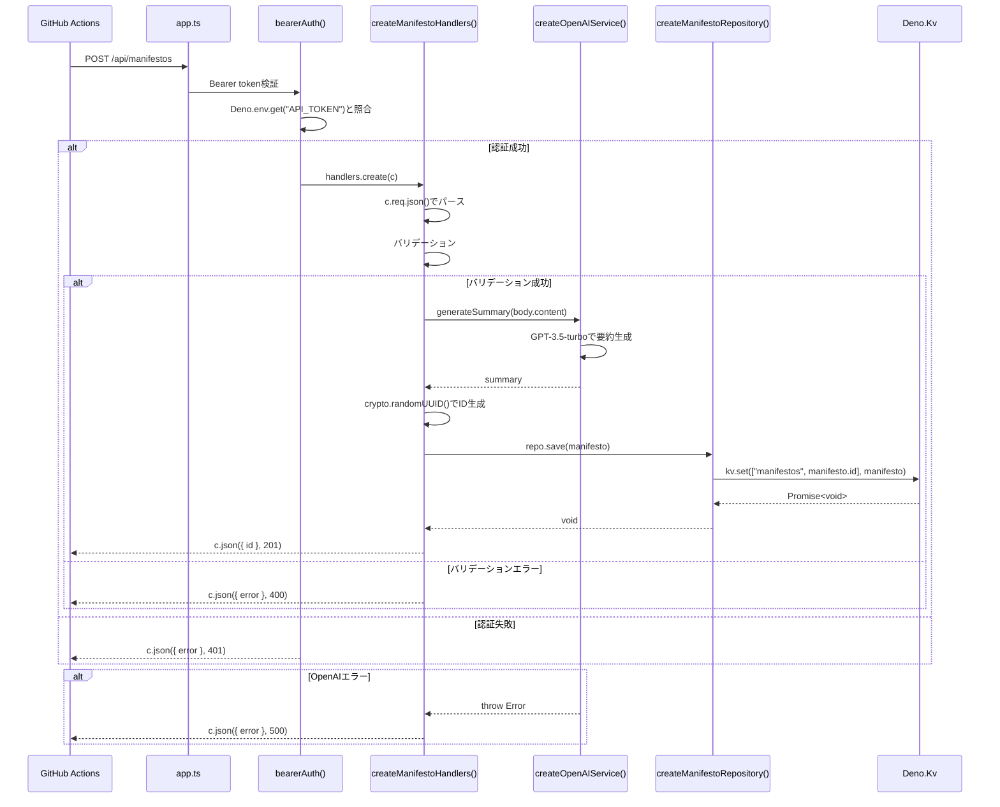

# マニフェスト登録API設計

## 概要
team-mirai/policyリポジトリからマニフェスト情報を受け取り、保存するAPIの詳細設計書です。

## API仕様

### マニフェスト登録

**エンドポイント**: `POST /api/manifestos`

**認証**: Bearer token（環境変数 `API_TOKEN`）

**リクエスト**:
```json
{
  "title": "環境政策の改革",
  "content": "詳細な内容...",
  "githubPrUrl": "https://github.com/team-mirai/policy/pull/123"
}
```

**レスポンス（成功時）**:
```json
{
  "id": "550e8400-e29b-41d4-a716-446655440000"
}
```

**レスポンス（エラー時）**:
```json
{
  "error": "Title is required"
}
```

## データモデル

### Manifesto
```typescript
export type Manifesto = {
  id: string;                // UUID v4
  title: string;             // マニフェストのタイトル
  summary: string;           // 変更内容の要約 (OpenAI APIで生成)
  content: string;           // 変更内容
  githubPrUrl: string;       // 元のPRのURL
  createdAt: Date;           // 作成日時
};
```

## バリデーションルール

- `title`: 必須、空文字不可
- `content`: 必須、空文字不可  
- `githubPrUrl`: 必須、空文字不可

## エラーレスポンス

| ステータスコード | エラー内容           |
|------------------|----------------------|
| 400              | バリデーションエラー |
| 401              | 認証エラー           |
| 500              | サーバーエラー       |

## KVストレージ設計

### キー設計
```
["manifestos", {manifesto_id}] -> Manifesto
```

## 実装の流れ

1. Bearer token認証
2. リクエストボディのパース
3. バリデーション
4. OpenAI APIで要約生成
5. Manifestoオブジェクトの作成
6. Deno KVへの保存
7. レスポンスの返却


