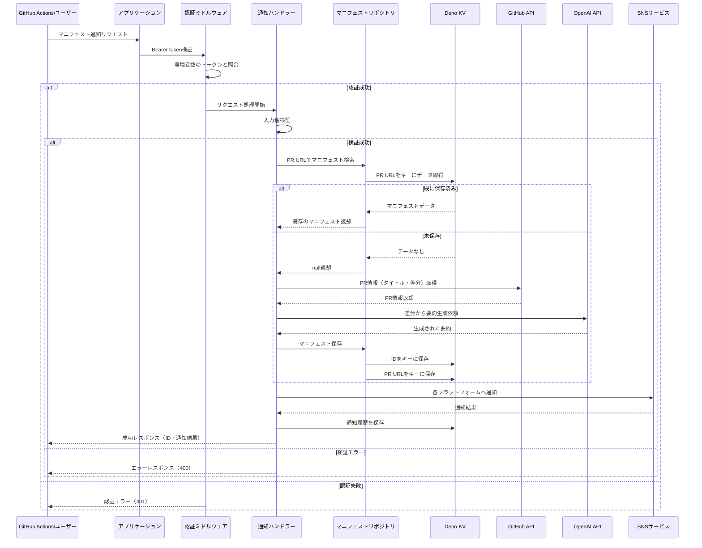

# マニフェスト通知API設計

## 概要

team-mirai/policyリポジトリのPR情報を受け取り、要約・保存・SNS通知を行うAPIの詳細設計書です。

## API仕様

### マニフェスト通知

**エンドポイント**: `POST /api/manifestos/notify`

**認証**: Bearer token（環境変数 `API_TOKEN`）

**リクエスト**:

```json
{
  "githubPrUrl": "https://github.com/team-mirai/policy/pull/123",
  "platforms": ["x", "slack"] // オプション（デフォルト: ["x"]）
}
```

**レスポンス（成功時）**:

```json
{
  "manifestoId": "550e8400-e29b-41d4-a716-446655440000",
  "notifications": {
    "x": {
      "success": true,
      "url": "https://x.com/TeamMirai/status/1234567890"
    },
    "slack": {
      "success": true
    }
  }
}
```

**レスポンス（一部失敗時）**:

```json
{
  "manifestoId": "550e8400-e29b-41d4-a716-446655440000",
  "notifications": {
    "x": {
      "success": true,
      "url": "https://x.com/TeamMirai/status/1234567890"
    },
    "slack": {
      "success": false,
      "message": "Slack API error: channel_not_found"
    }
  }
}
```

**レスポンス（エラー時）**:

```json
{
  "error": "Failed to fetch PR information"
}
```

### マニフェスト一覧取得

**エンドポイント**: `GET /api/manifestos`

**認証**: Bearer token（環境変数 `API_TOKEN`）

**レスポンス（成功時）**:

```json
{
  "manifestos": [
    {
      "id": "550e8400-e29b-41d4-a716-446655440000",
      "title": "環境政策の改革",
      "summary": "環境保護に関する新しい政策...",
      "content": "詳細な内容...",
      "githubPrUrl": "https://github.com/team-mirai/policy/pull/123",
      "createdAt": "2024-01-01T00:00:00.000Z"
    }
  ]
}
```

## データモデル

### Manifesto

```typescript
export type Manifesto = {
  id: string; // UUID v4
  title: string; // マニフェストのタイトル
  summary: string; // 変更内容の要約 (OpenAI APIで生成)
  content: string; // 変更内容
  githubPrUrl: string; // 元のPRのURL
  createdAt: Date; // 作成日時
};
```

### NotificationHistory

```typescript
export type NotificationHistory = {
  id: string; // UUID v4
  manifestoId: string; // 関連するマニフェストID
  githubPrUrl: string; // PR URL（検索用）
  platform: string; // プラットフォーム名（"x", "slack"等）
  postId: string; // 投稿ID（X: tweetId, Slack: timestamp等）
  postUrl?: string; // 投稿URL（取得可能な場合）
  postedAt: Date; // 投稿日時
  impressions?: number; // インプレッション数（後で更新可能）
  lastUpdatedAt?: Date; // インプレッション更新日時
};
```

## バリデーションルール

- `githubPrUrl`: 必須、空文字不可、有効なGitHub PR URL
- `platforms`: オプション、配列、値は "x", "slack" のみ許可

## エラーレスポンス

| ステータスコード | エラー内容           |
| ---------------- | -------------------- |
| 400              | バリデーションエラー |
| 401              | 認証エラー           |
| 500              | サーバーエラー       |

## KVストレージ設計

### キー設計

```
// マニフェストデータ
["manifestos", {manifesto_id}] -> Manifesto
["manifestos", "by-pr-url", {encoded_pr_url}] -> Manifesto

// 通知履歴
["notifications", {notification_id}] -> NotificationHistory
["notifications", "by-manifesto", {manifesto_id}, {platform}] -> NotificationHistory[]
["notifications", "by-platform", {platform}, {YYYY-MM-DD}] -> NotificationHistory[]
```

※ PR URLはキーとして使用するためにエンコード（例: `encodeURIComponent()`） ※
通知履歴は複数の検索パターンに対応（マニフェスト別、プラットフォーム別、日付別）

## 実装の流れ

1. Bearer token認証
2. リクエストボディのパース
3. バリデーション
4. PR URLでKVを検索
   - 保存済みの場合: 既存データを使用
   - 未保存の場合: a. GitHub APIでPR情報を取得 b. OpenAI APIで要約生成 c.
     ManifestoオブジェクトをKVに保存
5. 各プラットフォームに通知
6. 通知履歴をKVに保存
7. レスポンスの返却


