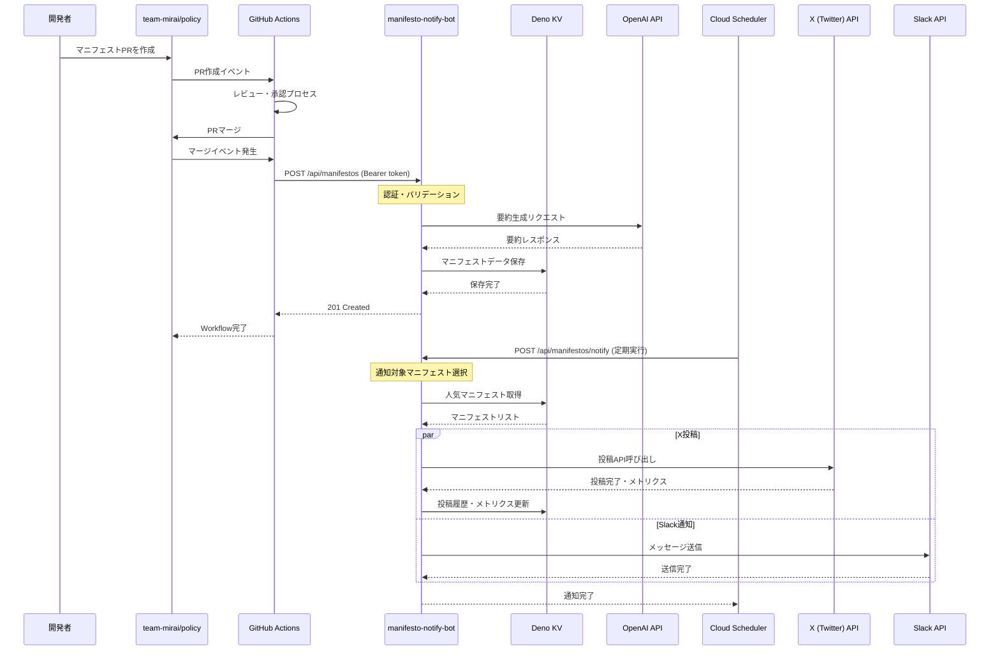
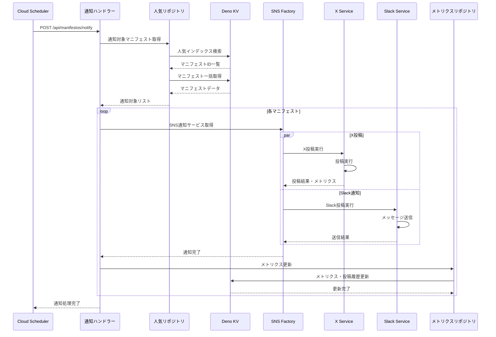
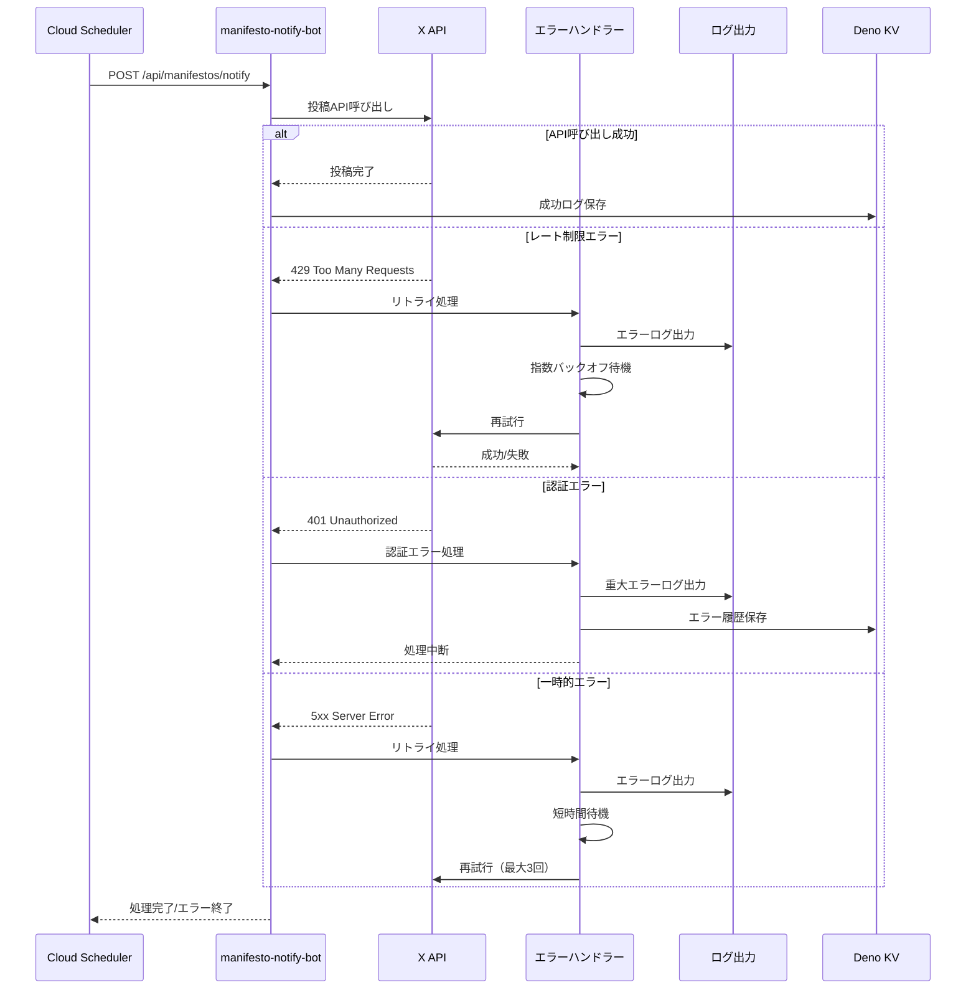
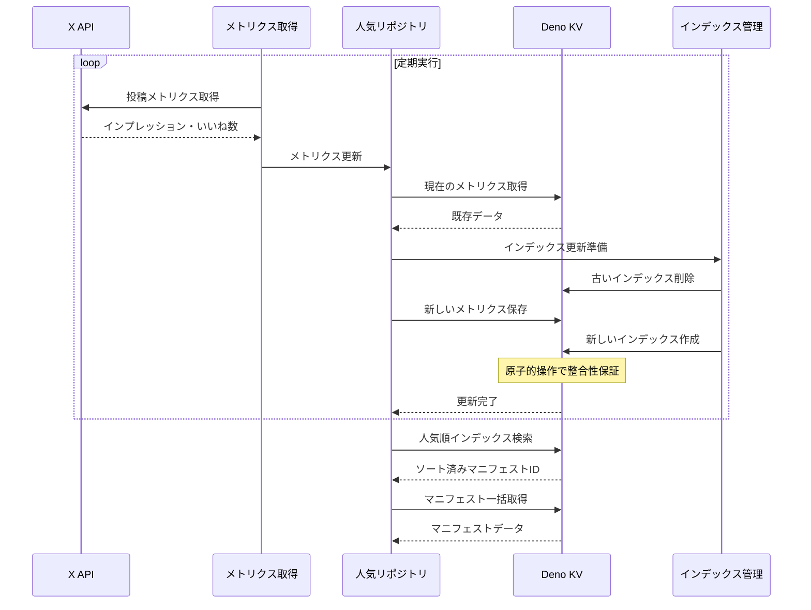

# システム全体シーケンス図

## 1. マニフェスト保存・通知システム全体フロー

```mermaid
sequenceDiagram
    participant Dev as 開発者
    participant Policy as team-mirai/policy
    participant GitHub as GitHub Actions
    participant Bot as manifesto-notify-bot
    participant DB as Deno KV
    participant OpenAI as OpenAI API
    participant Scheduler as Cloud Scheduler
    participant X as X (Twitter) API
    participant Slack as Slack API

    %% マニフェスト登録フロー
    Dev->>Policy: マニフェストPRを作成
    Policy->>GitHub: PR作成イベント
    GitHub->>GitHub: レビュー・承認プロセス
    GitHub->>Policy: PRマージ
    Policy->>GitHub: マージイベント発生
    GitHub->>Bot: POST /api/manifestos (Bearer token)
    
    note over Bot: 認証・バリデーション
    Bot->>OpenAI: 要約生成リクエスト
    OpenAI-->>Bot: 要約レスポンス
    Bot->>DB: マニフェストデータ保存
    DB-->>Bot: 保存完了
    Bot-->>GitHub: 201 Created
    GitHub-->>Policy: Workflow完了

    %% 定期通知フロー
    Scheduler->>Bot: POST /api/manifestos/notify (定期実行)
    note over Bot: 通知対象マニフェスト選択
    Bot->>DB: 人気マニフェスト取得
    DB-->>Bot: マニフェストリスト
    
    par X投稿
        Bot->>X: 投稿API呼び出し
        X-->>Bot: 投稿完了・メトリクス
        Bot->>DB: 投稿履歴・メトリクス更新
    and Slack通知
        Bot->>Slack: メッセージ送信
        Slack-->>Bot: 送信完了
    end
    
    Bot-->>Scheduler: 通知完了
```

## 3. 定期通知システム詳細フロー

```mermaid
sequenceDiagram
    participant Scheduler as Cloud Scheduler
    participant NotifyHandler as 通知ハンドラー
    participant PopularRepo as 人気リポジトリ
    participant KV as Deno KV
    participant SNSFactory as SNS Factory
    participant XService as X Service
    participant SlackService as Slack Service
    participant MetricsRepo as メトリクスリポジトリ

    Scheduler->>NotifyHandler: POST /api/manifestos/notify
    NotifyHandler->>PopularRepo: 通知対象マニフェスト取得
    
    PopularRepo->>KV: 人気インデックス検索
    KV-->>PopularRepo: マニフェストID一覧
    PopularRepo->>KV: マニフェスト一括取得
    KV-->>PopularRepo: マニフェストデータ
    PopularRepo-->>NotifyHandler: 通知対象リスト

    loop 各マニフェスト
        NotifyHandler->>SNSFactory: SNS通知サービス取得
        
        par X投稿
            SNSFactory->>XService: X投稿実行
            XService->>XService: 投稿実行
            XService-->>SNSFactory: 投稿結果・メトリクス
        and Slack通知
            SNSFactory->>SlackService: Slack投稿実行
            SlackService->>SlackService: メッセージ送信
            SlackService-->>SNSFactory: 送信結果
        end
        
        SNSFactory-->>NotifyHandler: 通知完了
        NotifyHandler->>MetricsRepo: メトリクス更新
        MetricsRepo->>KV: メトリクス・投稿履歴更新
        KV-->>MetricsRepo: 更新完了
    end
    
    NotifyHandler-->>Scheduler: 通知処理完了
```

## 4. エラーハンドリング・リトライフロー

```mermaid
sequenceDiagram
    participant Scheduler as Cloud Scheduler
    participant Bot as manifesto-notify-bot
    participant X as X API
    participant ErrorHandler as エラーハンドラー
    participant Logger as ログ出力
    participant KV as Deno KV

    Scheduler->>Bot: POST /api/manifestos/notify
    Bot->>X: 投稿API呼び出し
    
    alt API呼び出し成功
        X-->>Bot: 投稿完了
        Bot->>KV: 成功ログ保存
    else レート制限エラー
        X-->>Bot: 429 Too Many Requests
        Bot->>ErrorHandler: リトライ処理
        ErrorHandler->>Logger: エラーログ出力
        ErrorHandler->>ErrorHandler: 指数バックオフ待機
        ErrorHandler->>X: 再試行
        X-->>ErrorHandler: 成功/失敗
    else 認証エラー
        X-->>Bot: 401 Unauthorized
        Bot->>ErrorHandler: 認証エラー処理
        ErrorHandler->>Logger: 重大エラーログ出力
        ErrorHandler->>KV: エラー履歴保存
        ErrorHandler-->>Bot: 処理中断
    else 一時的エラー
        X-->>Bot: 5xx Server Error
        Bot->>ErrorHandler: リトライ処理
        ErrorHandler->>Logger: エラーログ出力
        ErrorHandler->>ErrorHandler: 短時間待機
        ErrorHandler->>X: 再試行（最大3回）
    end
    
    Bot-->>Scheduler: 処理完了/エラー終了
```

## 5. マニフェスト人気度管理フロー

```mermaid
sequenceDiagram
    participant XAPI as X API
    participant MetricsService as メトリクス取得
    participant PopularRepo as 人気リポジトリ
    participant KV as Deno KV
    participant IndexManager as インデックス管理

    %% 定期的なメトリクス取得
    loop 定期実行
        MetricsService->>XAPI: 投稿メトリクス取得
        XAPI-->>MetricsService: インプレッション・いいね数
        
        MetricsService->>PopularRepo: メトリクス更新
        PopularRepo->>KV: 現在のメトリクス取得
        KV-->>PopularRepo: 既存データ
        
        PopularRepo->>IndexManager: インデックス更新準備
        IndexManager->>KV: 古いインデックス削除
        PopularRepo->>KV: 新しいメトリクス保存
        IndexManager->>KV: 新しいインデックス作成
        
        note over KV: 原子的操作で整合性保証
        KV-->>PopularRepo: 更新完了
    end
    
    %% 人気マニフェスト取得
    PopularRepo->>KV: 人気順インデックス検索
    KV-->>PopularRepo: ソート済みマニフェストID
    PopularRepo->>KV: マニフェスト一括取得
    KV-->>PopularRepo: マニフェストデータ
```
